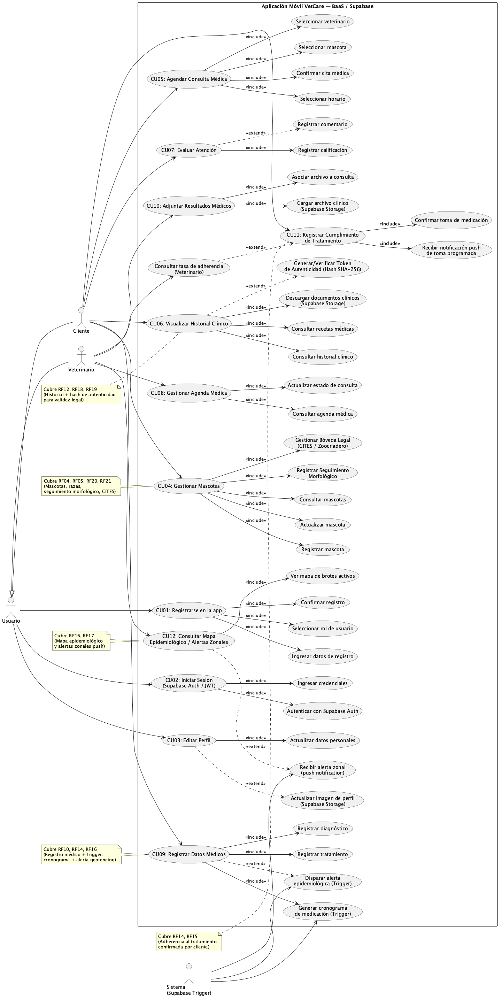

# 📱 Programacion Movil
Proyecto del curso de Programación Móvil de la Universidad de Lima.

## Índice

Pulsa cualquiera de los subtítulos para ir directamente a la sección:

1. [Integrantes](#integrantes)
2. [Enunciado del Programa](#enunciado-del-programa-aplicación-móvil-veterinaria)
3. [Explicación del entorno de desarrollo](#explicación-del-entorno-de-desarrollo-requisitos-previos)
4. [Requerimientos](#requerimientos)
5. [Diagrama de Despliegue](#diagrama-de-despliegue)
6. [Casos de Uso](#casos-de-uso)
7. [Descripción de Casos de Uso](#descripción-de-casos-de-uso)
8. [Diagrama de Base de Datos](#diagrama-de-base-de-datos-schema)
9. [Diagrama de Clases](#diagrama-de-clases)
10. [Mockups](#mockups-prototipos-de-interfaz)

## 👥 Integrantes
- Juan Zavalaga
- Franco Melchor  
- Matias  Alarcon
- Nicolas Champa  

## 📝 Enunciado del Programa (Aplicación Móvil Veterinaria)

VetCare es una aplicación móvil para la gestión integral de servicios de salud animal y el historial médico de pacientes veterinarios, con soporte avanzado para especies exóticas. El sistema centraliza la información de clientes (dueños de mascotas) y veterinarios, quienes registran nombre, apellidos, correo electrónico, teléfono de contacto, foto de perfil y sexo.

Existen dos tipos de perfiles de usuario:
- **Clientes:** Dueños de mascotas, con registro de dirección, documento de identidad y coordenadas geográficas para alertas epidemiológicas.
- **Veterinarios:** Profesionales de la clínica con número de colegiatura y años de experiencia.

Los clientes pueden registrar múltiples mascotas, identificando nombre, fecha de nacimiento, sexo, peso actual y fotografía. Cada mascota pertenece a una raza específica asociada a una especie (canino, felino, exótico u otro). Para animales exóticos no convencionales (tortugas Mata mata/Taricaya, invertebrados, etc.), el sistema amplía el perfil con **seguimiento morfológico** (fotos alineadas en el tiempo para evaluar crecimiento de caparazones o coloración) y una **bóveda legal** de documentos como facturas de zoocriaderos y certificados CITES que demuestran el origen legal del animal.

A través de la app, los clientes agendan consultas médicas seleccionando veterinario, horario disponible y motivo de visita. Al registrar el diagnóstico y tratamiento, el sistema genera automáticamente un **cronograma de medicación** en base de datos. El cliente puede confirmar cada toma desde notificaciones push, y el veterinario consulta la **tasa de adherencia** al tratamiento. Si el diagnóstico es contagioso, un trigger evalúa la zona geográfica y notifica a dueños cercanos sobre el brote activo, visible también en un **mapa epidemiológico** dentro de la app.

Al finalizar citas críticas (vacunas, cirugías), el sistema genera un **hash SHA-256** del registro médico, permitiendo al cliente generar y verificar un token de autenticidad para demostrar la validez legal del historial en otras clínicas o viajes internacionales.

Las atenciones se clasifican en especialidades (medicina general, dermatología, traumatología, peluquería, etc.). Los clientes pueden calificar (1-5) y dejar reseñas sobre consultas completadas.

## Explicación del entorno de desarrollo (Requisitos Previos)

Para la construcción de este proyecto, se ha seleccionado un stack tecnológico orientado a una arquitectura **Serverless / BaaS (Backend-as-a-Service)**. Flutter se comunica directamente con Supabase, eliminando la necesidad de una API REST intermedia. A continuación, se detallan las herramientas utilizadas, su propósito y el proceso de configuración necesario.

### Stack Tecnológico

| Capa | Tecnología | Propósito |
|------|-----------|----------|
| **Front-end / Móvil** | Flutter + Dart | App compilada nativamente para Android e iOS |
| **Autenticación** | Supabase Auth (JWT) | Registro, login y autorización por roles mediante JWT |
| **Base de Datos** | Supabase PostgreSQL | Base de datos relacional gestionada en la nube |
| **Almacenamiento de Archivos** | Supabase Storage | Imágenes, documentos médicos y archivos CITES |
| **Lógica de Negocio Serverless** | Supabase Edge Functions + Database Triggers | Generación de cronogramas, hashes de autenticidad y alertas epidemiológicas |

### 1. Flutter y Dart (Front-end)
* **Descripción:** Flutter es el SDK de Google para crear aplicaciones compiladas nativamente para móvil desde una única base de código. Utiliza **Dart**, un lenguaje optimizado para interfaces de usuario rápidas y reactivas.
* **Instalación:**
    1.  Descarga el SDK de Flutter desde [flutter.dev](https://docs.flutter.dev/get-started/install) según tu sistema operativo.
    2.  Extrae el archivo en una ruta sin espacios (ej: `C:\src\flutter`).
    3.  Agrega la carpeta `bin` de Flutter a las variables de entorno de tu sistema (**PATH**).
    4.  Ejecuta `flutter doctor` en la terminal para verificar dependencias de Android/iOS pendientes.

### 2. Supabase (BaaS)
* **Descripción:** Plataforma open-source de Backend-as-a-Service que provee autenticación JWT, base de datos PostgreSQL, almacenamiento de archivos y funciones serverless (Edge Functions + Triggers). Reemplaza completamente la API REST intermedia.
* **Configuración:**
    1.  Crea un proyecto en [supabase.com](https://supabase.com).
    2.  Copia las variables `SUPABASE_URL` y `SUPABASE_ANON_KEY` desde el panel del proyecto.
    3.  Agrega el paquete en Flutter: `flutter pub add supabase_flutter`.
    4.  Inicializa el cliente en `main.dart`: `await Supabase.initialize(url: ..., anonKey: ...)`.

### 3. Visual Studio Code (IDE)
* **Descripción:** Editor de código fuente versátil que sirve como estación de trabajo principal para el desarrollo de todas las capas de la aplicación.
* **Configuración:**
    1.  Descarga e instala [VS Code](https://code.visualstudio.com/).
    2.  Instala la extensión oficial de **Flutter** (esto instalará automáticamente Dart).
    3.  Instala la extensión **Supabase** para autocompletado de SQL y gestión del proyecto.

### 4. Android Studio
* Para mayor comodidad en el entorno de desarrollo móvil (Front-end) y no depender de extensiones en VS Code, instalar Android Studio es la mejor opción (incluyendo SDKs de Android).

## Requerimientos

### 1. Requerimientos Funcionales:
Lo que el sistema debe hacer (acciones y funcionalidades específicas)

* Gestión de Usuarios y Autenticación:
    * **RF01:** El sistema debe permitir el registro de nuevos usuarios asignándoles un rol específico (Cliente o Veterinario).
    * **RF02:** El sistema debe permitir a los usuarios iniciar sesión utilizando su correo electrónico y contraseña.
    * **RF03:** El sistema debe permitir a los usuarios (clientes y veterinarios) editar la información de su perfil (teléfono, foto de perfil, et*) según los campos permitidos para su ro*

* Gestión de Mascotas y Catálogo:
    * **RF04:** El sistema debe permitir a los clientes registrar, editar y visualizar el perfil de sus mascotas (nombre, fecha de nacimiento*sexo, peso actual y foto).
    * **RF05:** El sistema debe mostrar un catálogo predefinido de especies y razas al momento de registrar una mascota, mostrando la descripció*y foto referencial de la raza.

* Gestión de Consultas (Agendamiento y Atención):
    * **RF06:** El sistema debe permitir al cliente agendar una consulta médica, seleccionando a la mascota, el veterinario, uno de los horarios disponibles y redactando el motivo de la visita.
    * **RF07:** El sistema debe asignar automáticamente el estado "Pendiente" a toda nueva consulta generada por un cliente.
    * **RF08:** El sistema debe permitir al veterinario visualizar una lista de las consultas que tiene agendadas.
    * **RF09:** El sistema debe permitir al veterinario cambiar el estado de la consulta (ej. Confirmada, En curso, Completada, Cancelada).
    * **RF10:** El sistema debe permitir al veterinario registrar los datos médicos de una consulta en curso o completada, incluyendo diagnóstico, tratamiento recetado y las especialidades aplicadas. Al guardar, el sistema generará automáticamente un cronograma de medicación en la base de datos.
    * **RF11:** El sistema debe permitir al veterinario subir y visualizar documentos adjuntos (archivos o imágenes como radiografías) vinculados a la consulta.
    * **RF12:** El sistema debe permitir al cliente visualizar el historial completo de consultas médicas de sus mascotas, incluyendo el detalle de diagnósticos, tratamientos recetados y documentos adjuntos (archivos o imágenes) proporcionados por el veterinario, una vez que la consulta tenga el estado "Completada".

* Sistema de Evaluación:
    * **RF13:** El sistema debe permitir al cliente otorgar una calificación (del 1 al 5) y escribir una reseña únicamente a las consultas que tengan el estado "Completada".

* Adherencia a Tratamientos:
    * **RF14:** El sistema debe permitir al cliente registrar el cumplimiento de cada toma de medicación generada por el cronograma, mediante confirmación desde notificaciones push.
    * **RF15:** El sistema debe permitir al veterinario consultar la tasa de adherencia al tratamiento de cada paciente.

* Alertas Epidemiológicas:
    * **RF16:** Al registrar un diagnóstico contagioso, un trigger en Supabase evaluará la ubicación geográfica del cliente y notificará a los dueños cercanos sobre el brote activo.
    * **RF17:** El sistema debe mostrar un mapa epidemiológico con alertas zonales activas accesible por el cliente.

* Historial Clínico con Autenticidad Criptográfica:
    * **RF18:** Al finalizar una cita crítica (vacunas, cirugías), Supabase generará un hash único (firma digital) del registro médico para garantizar su inmutabilidad.
    * **RF19:** El cliente debe poder generar y verificar el token de autenticidad de un historial clínico para demostrar su validez legal en otras clínicas o viajes internacionales.

* Módulo de Especies Exóticas:
    * **RF20:** El sistema debe permitir registrar seguimiento morfológico de mascotas exóticas, incluyendo fotografías alineadas a lo largo del tiempo para evaluar crecimiento (ej. caparazones de tortugas Mata mata/Taricaya, coloración de invertebrados).
    * **RF21:** El sistema debe permitir gestionar una bóveda legal de documentos de mascotas exóticas, incluyendo facturas de zoocriaderos y certificados CITES que demuestren el origen legal del animal.

### 2. Requerimientos No Funcionales:
* Cómo debe comportarse el sistema (atributos de calidad, restricciones y rendimiento).
    1. **RNF01 (Seguridad):** Las contraseñas de los usuarios deben estar encriptadas en la base de datos (por ejemplo, mediante algoritmos como bcrypt).
    2. **RNF02 (Seguridad/Autorización):** El sistema debe restringir las vistas y acciones según el rol del usuario (ej. un cliente no puede modificar un diagnóstico ni cambiar el estado de la consulta).
    3. **RNF03 (Autenticación):** El sistema debe usar JWT para la autenticación del usuario antes de ejecutar servicios, este token debe ser guardado en "Keychain/Keystore" del móvil y ser enviado en la cabecera (Authorization) en cada petición.
    4. **RNF04 (Rendimiento):** La aplicación móvil debe cargar las vistas principales en menos de 3 segundos bajo una conexión de red estándar (4G/WIFI).
    5. **RNF05 (Almacenamiento):** Las imágenes (fotos de perfil, mascotas, documentos médicos) deben ser comprimidas antes de subirse al servidor para optimizar el espacio y los tiempos de carga.
    6. **RNF06 (Disponibilidad):** Supabase y su base de datos deben garantizar una alta disponibilidad (uptime del 99.9%) al estar gestionados como servicio cloud.
    7. **RNF07 (Usabilidad):** La interfaz debe ser intuitiva y adaptable (Responsive) a diferentes tamaños de pantalla en dispositivos móviles (smartphones y tablets).

## Casos de Uso
Los casos de uso representan las interacciones principales de los actores con el sistema.

* **Actor Común: Cliente y Veterinario**
    * **CU01 - Registrarse en la app:** El actor completa el formulario para crear su cuenta de usuario con su rol respectivo.
    * **CU02 - Iniciar Sesión:** El actor ingresa sus credenciales (Supabase Auth / JWT) para acceder a sus funciones habilitadas.
    * **CU03 - Editar Perfil:** El actor modifica sus datos personales de contacto o actualiza su foto de perfil (almacenada en Supabase Storage).

* **Actor: Cliente**
    * **CU04 - Gestionar Mascotas:** El cliente crea, actualiza o visualiza el perfil de sus mascotas. Para especies exóticas, incluye el registro de seguimiento morfológico (<<include>>) y la gestión de bóveda legal CITES (<<include>>).
    * **CU05 - Agendar Consulta Médica:** El cliente elige a su mascota, selecciona a un veterinario, escoge un horario disponible y envía la solicitud de cita.
    * **CU06 - Visualizar Historial Clínico:** El cliente consulta los registros médicos de sus mascotas, descarga documentos adjuntos y puede generar/verificar el token de autenticidad SHA-256 del historial (<<extend>>).
    * **CU07 - Evaluar Atención:** Tras finalizar una consulta, el cliente otorga una calificación (1-5) y deja un comentario sobre el servicio recibido.
    * **CU11 - Registrar Cumplimiento de Tratamiento:** El cliente confirma cada toma de medicación programada desde notificaciones push de la app, permitiendo al veterinario consultar la tasa de adherencia.
    * **CU12 - Consultar Mapa Epidemiológico / Recibir Alertas Zonales:** El cliente visualiza el mapa de brotes activos en su zona o recibe notificaciones push cuando hay un caso contagioso registrado cerca de su dirección.

* **Actor: Veterinario**
    * **CU08 - Gestionar Agenda Médica:** El veterinario visualiza su calendario de citas y actualiza el estado de las consultas solicitadas.
    * **CU09 - Registrar Datos Médicos:** El veterinario registra el diagnóstico y tratamiento de una consulta. Al guardar, el sistema genera automáticamente un cronograma de medicación (trigger) y, si el diagnóstico es contagioso, dispara una alerta epidemiológica por geofencing (<<extend>>).
    * **CU10 - Adjuntar Resultados Médicos:** El veterinario sube archivos PDF o imágenes (análisis de sangre, radiografías) a la consulta específica vía Supabase Storage.

## Descripción de Casos de Uso

El siguiente diagrama muestra todas las interacciones del sistema con relaciones `<<include>>` y `<<extend>>`:

---

### Casos de Uso Comunes (Cliente y Veterinario)

**CU01 - Registrarse en la app**
El actor completa el formulario de registro seleccionando su rol (Cliente o Veterinario). Incluye: ingresar datos, seleccionar rol y confirmar registro.

**CU02 - Iniciar Sesión**
El actor ingresa credenciales para autenticarse mediante Supabase Auth, obteniendo un JWT almacenado en Keychain/Keystore.

**CU03 - Editar Perfil**
El actor actualiza sus datos personales de contacto. Opcionalmente (<<extend>>) puede actualizar su foto de perfil almacenada en Supabase Storage.

---

### Casos de Uso — Cliente

**CU04 - Gestionar Mascotas**
El cliente crea, actualiza y consulta el perfil de sus mascotas. Para especies exóticas, incluye (<<include>>) el registro de seguimiento morfológico (fotos alineadas en el tiempo para evaluar crecimiento de caparazones o coloración) y la gestión de bóveda legal (certificados CITES y facturas de zoocriaderos).

**CU05 - Agendar Consulta Médica**
El cliente selecciona mascota, veterinario, horario disponible y redacta el motivo de visita. El sistema asigna automáticamente el estado "Pendiente".

**CU06 - Visualizar Historial Clínico**
El cliente consulta el historial completo de consultas completadas de sus mascotas: diagnósticos, recetas y documentos adjuntos. Opcionalmente (<<extend>>) puede generar o verificar el token de autenticidad SHA-256 del registro para demostrar su validez legal en otras clínicas o viajes internacionales.

**CU07 - Evaluar Atención**
Tras finalizar una consulta, el cliente otorga una calificación de 1 a 5 estrellas. Opcionalmente (<<extend>>) agrega un comentario detallado sobre el servicio.

**CU11 - Registrar Cumplimiento de Tratamiento**
El cliente recibe notificaciones push por cada toma programada en el cronograma de medicación generado por el veterinario. Al confirmar la toma, el sistema registra la adherencia, permitiendo al veterinario consultar el porcentaje de cumplimiento del tratamiento.

**CU12 - Consultar Mapa Epidemiológico / Recibir Alertas Zonales**
El cliente accede a un mapa con los brotes activos en su zona. Cuando un veterinario registra un diagnóstico contagioso, un trigger de Supabase evalúa las coordenadas del cliente y envía notificaciones push a los dueños de mascotas dentro del radio de riesgo.

---

### Casos de Uso — Veterinario

**CU08 - Gestionar Agenda Médica**
El veterinario consulta su calendario de citas y actualiza el estado de cada consulta (Pendiente → Confirmada → En curso → Completada / Cancelada).

**CU09 - Registrar Datos Médicos**
El veterinario registra diagnóstico, tratamiento e indica si el diagnóstico es contagioso. Al guardar (<<include>>), el sistema genera automáticamente un cronograma de medicación vía trigger. Si el diagnóstico es contagioso (<<extend>>), se dispara una alerta epidemiológica por geofencing hacia los clientes cercanos.

**CU10 - Adjuntar Resultados Médicos**
El veterinario sube archivos PDF o imágenes (radiografías, análisis de sangre) directamente a Supabase Storage, asociándolos a la consulta correspondiente.

## Diagrama de Base de Datos (Schema)

Para soportar todos los requisitos funcionales, se diseñó un modelo de entidades relacional que incluye:

- **users y roles**: Gestión de usuarios con autenticación JWT via Supabase Auth (clientes y veterinarios)
- **clients y veterinarians**: Datos específicos por tipo de usuario
- **species y breeds**: Catálogo predefinido de especies y razas
- **pets**: Registro de mascotas con sus atributos (nombre, fecha de nacimiento, sexo, peso, foto)
- **veterinarian_availability**: Disponibilidad semanal de veterinarios con intervalos de tiempo
- **consultations**: Registro de consultas médicas con estado, diagnóstico, tratamiento y hash de autenticidad
- **consultation_documents**: Adjuntos de radiografías y análisis (almacenados en Supabase Storage)
- **consultation_specialties**: Clasificación de especialidades por consulta
- **medication_schedules**: Cronogramas de medicación generados automáticamente desde CU09
- **treatment_adherence**: Registro de cumplimiento de tomas confirmadas por el cliente (CU11)
- **epidemiological_alerts**: Alertas de brotes activos por zona geográfica (CU12)
- **morphological_records**: Fotos alineadas en el tiempo para seguimiento de crecimiento en especies exóticas (CU04)
- **legal_documents**: Bóveda de certificados CITES y facturas de zoocriaderos (CU04)

---

## Diagrama de Clases
El diagrama de clases muestra las entidades del dominio, sus atributos y las relaciones entre ellas. Sirve como referencia directa para implementar los modelos de datos y las migraciones de Supabase.

Clases clave:
- `User`: datos comunes de autenticación y perfil (via Supabase Auth + JWT). Incluye coordenadas geográficas para alertas epidemiológicas.
- `Client` y `Veterinarian`: especializan al usuario según su rol, con control de acceso por RLS en Supabase.
- `Pet`: perfil de cada mascota. Se relaciona con `MorphologicalRecord` (seguimiento morfológico para exóticos) y `LegalDocument` (bóveda CITES).
- `Consultation`: flujo principal de atención médica. Al completarse genera un `MedicationSchedule` vía trigger y, si el diagnóstico es contagioso, una `EpidemiologicalAlert`.
- `ConsultationDocument`: archivos adjuntos almacenados en Supabase Storage.
- `ConsultationSpecialty`: vincula consultas con especialidades clínicas.
- `VeterinarianAvailability`: intervalos de disponibilidad del veterinario.
- `MedicationSchedule`: cronograma de medicación generado automáticamente al registrar tratamiento (CU09).
- `TreatmentAdherence`: registro de cada toma confirmada por el cliente vía push (CU11).
- `EpidemiologicalAlert`: alerta de brote activo generada por geofencing (CU12).
- `MorphologicalRecord`: registro fotográfico alineado en el tiempo para especies exóticas (CU04).
- `LegalDocument`: certificados CITES y facturas de zoocriaderos (CU04).
- `Species`, `Breed` y `Specialty`: catálogos del sistema.

---

## Diagrama de Despliegue

La arquitectura del sistema está compuesta por:

1. **Dispositivo Móvil**: Aplicación Flutter con módulo de compresión de imágenes y almacenamiento seguro de JWT en Keychain/Keystore
2. **Supabase Auth**: Autenticación con JWT, gestión de sesiones y control de acceso por roles (RLS – Row Level Security)
3. **Supabase PostgreSQL**: Base de datos relacional gestionada en la nube con triggers para lógica de negocio
4. **Supabase Storage**: Almacenamiento de imágenes, documentos médicos y archivos CITES
5. **Supabase Edge Functions**: Funciones serverless para generación de hashes de autenticidad y notificaciones push

---

## Mapeo de Requerimientos No Funcionales al Diagrama de Despliegue

| RNF | Descripción | Componente en Diagrama |
|-----|-----------|----------------------|
| **RNF01** | Encriptación de contraseñas (bcrypt) | Supabase Auth (gestionado en la nube) |
| **RNF02** | Control de acceso por rol | Supabase RLS (Row Level Security) |
| **RNF03** | Autenticación JWT guardada en Keychain | Keystore en Dispositivo Móvil + Supabase Auth |
| **RNF04** | Rendimiento < 3 segundos | SDK Supabase con caché + Red HTTPS |
| **RNF05** | Compresión de imágenes antes de subir | Módulo de Compresión en Dispositivo Móvil → Supabase Storage |
| **RNF06** | Alta disponibilidad 99.9% | Supabase Cloud (PostgreSQL gestionado) |
| **RNF07** | Interfaz responsive | Aplicación Flutter (multiplataforma) |

## Mockups (Prototipos de Interfaz)

Los prototipos de interfaz están siendo rediseñados para adaptarse a las nuevas funcionalidades core.
