# 📱 Programacion Movil

Proyecto del curso de Programación Móvil de la Universidad de Lima.

## Índice

Pulsa cualquiera de los subtítulos para ir directamente a la sección:

1. [Integrantes](#integrantes)
2. [Enunciado del Programa](#enunciado-del-programa-aplicación-móvil-veterinaria)
3. [Explicación del entorno de desarrollo](#explicación-del-entorno-de-desarrollo-requisitos-previos)
4. [Requerimientos](#requerimientos)
5. [Diagrama de Despliegue](#diagrama-de-despliegue)
6. [Casos de Uso](#casos-de-uso)
7. [Descripción de Casos de Uso](#descripción-de-casos-de-uso)
8. [Diagrama de Base de Datos](#diagrama-de-base-de-datos-schema)
9. [Diagrama de Clases](#diagrama-de-clases)
10. [Mockups](#mockups-prototipos-de-interfaz)


## 👥 Integrantes

- Matías Alarcón
- Nicolás Champa  
- Franco Melchor  
- Juan Zavalaga

## 📝 Enunciado del Programa (Aplicación Móvil Veterinaria)

Debido a la transformación tecnológica que varias empresas están llevando en la actualidad, una clínica veterinaria requiere del desarrollo de una aplicación móvil para la gestión de sus servicios médicos, veterinarios, pacientes y dueños de mascotas. Esta se dirije a dos tipos de usuarios: veterinarios y dueños de mascotas. Debido a que cada uno tendrá información pública y privada, el sistema centraliza la información de todos sus usuarios para su acceso inmediato y remoto. Los dueños y veterinarios poseen información pública para su contacto y privada para la gestión de sus actividades en entornos propios. Cada dueño podrá tener varios pacientes y cada uno puede acceder al servicio médico ofrecido por los veterinarios en sus horarios disponibles. Por parte de los veterinarios, ellos pueden gestionar sus citas médicas, modificar la información médica de sus pacientes y contactarse con los dueños. Finalmennte, para medir la calidad del servicio, se posee la capacidad de valorar a los veterinarios.

## Explicación del entorno de desarrollo (Requisitos Previos)

Para la construcción de este proyecto, se ha seleccionado un stack tecnológico orientada a una arquitectura cliente-servidor. A continuación, se detallan las herramientas utilizadas, su propósito y el proceso de configuración necesario.

### 1. Flutter y Dart (Front-end)
* **Descripción:** Flutter es el SDK de Google para crear aplicaciones compiladas nativamente para móvil desde una única base de código. Utiliza **Dart**, un lenguaje optimizado para interfaces de usuario rápidas y reactivas.
* **Instalación:**
    1. Descarga el SDK de Flutter desde [flutter](https://docs.flutter.dev/get-started/install) según tu sistema operativo.
    2.   Extrae el archivo en una ruta sin espacios (ej: `C:\src\flutter`).
    3.   Agrega la carpeta `bin` de Flutter a las variables de entorno de tu sistema (**PATH**).
    4.   Ejecuta `flutter doctor` en la terminal para verificar dependencias de Android/iOS pendientes.

### 2. Ruby (Backend)
* **Descripción:** Ruby es un lenguaje dinámico y orientado a objetos. En este proyecto se utiliza para implementar la lógica de negocio y el sistema de sincronización (API REST) entre el almacenamiento local del dispositivo y la base de datos central.
* **Instalación:**
    1. **Windows:** Usa [RubyInstaller](https://rubyinstaller.org/) (versión con Devkit). 
    2. Al instalar, marcaremos la opción "Add Ruby executables to your PATH".
    3. Luego de la instalación, se verifica en el cmd:
    ```bash
    ruby -v
    ```
    4. Luego se instala blunder para gestionar dependencias
    ```bash
    gem install bundler
    ```

### 3. SQLite (Base de Datos Local)
* **Descripción:** SQLite es un sistema de base de datos relacional ligero y embebido. Se caracterisa por no requerir de un servidor independiente, lo que facilita la portabilidad y agiliza el desarrollo. Por esta razón se usará para el almacenamiento de datos locales de los usuarios.
* **Instalación:**
    1.  Añadimos las dependencias a nuestro proyecto en flutter dentro de `pubspec.yaml`.
     ```YAML
    dependencies:
        drift: ^latest
        sqlite3_flutter_libs: ^latest
        path_provider: ^latest
        dio: ^latest
    ```

### 4. Supabase (Base de Datos en la Nube)
* **Descripción**: Supabase es una plataforma Backend-as-a-Service que ofrece base de datos PostgreSQL, autenticación y APIs automáticas. Se usará para el almacenaje centralizado de los datos de la aplicación.
* **Instalación:**
    1. Crear un proyecto en [supabase](https://supabase.com/).
    2.  Obtener las credenciales `SUPABASE_URL`, `ANON_KEY` y `SERVICE_ROLE_KEY`. El primero identificará la ubicación de nuestra base de datos, el segundo permitirá al fron end visualizar los datos y el tercero modificarlos en el backend.

### 5. Railway (Despliegue del Backend)
* **Descripción**: Railway es una plataforma de despliegue en la nube que permite alojar el backend de aplicaciones con costo bajo. Se usará para ejecutar la lógica del negocio y comunicar la app con la base de datos en Supabase
* **Instalación:**
1. Crear una cuenta en [railway](https://railway.app).
2. Conectar el repositorio del backend (GitHub o Git).
3. Crear un nuevo proyecto seleccionando “Deploy from GitHub Repo”.
4. Obtener la URL pública para la comunicación del frontend con el backend.

### 5. Visual Studio Code (IDE)
* **Descripción:** Editor de código fuente versátil que sirve como estación de trabajo principal para el desarrollo de todas las capas de la aplicación.
* **Instalación:**
    1.  Descarga e instala [VS Code](https://code.visualstudio.com/).
    2.  Instala las siguientes extensiones: 
        * Flutter (incluye Dart)
        * Ruby LSP

### 6. Android Studio
* **Descripción:**  Android Studio servirá para la emulación de equipos android en Windows, se escogió porque ya posee integración nativa con Flutter.
* **Instalación:**
    1. Descargar [Android Studio](https://developer.android.com/studio)
    2. Instalar el **SDK de Android** y **Android Virtual Device** durante la configuración inicial.
    3. Configurar variables de entorno a nuestro usuario: 
    ```BASH
    ANDROID_SDK_ROOT = C:\Users\TU_USUARIO\AppData\Local\Android\Sdk
    ```
    4. Aceptar las licencias dentro de flutter
    ```BASH
    flutter doctor --android-licenses
    ```

## Diagrama de Despliegue

La arquitectura del sistema está compuesta por:

1. **Dispositivo Móvil**: Aplicación Flutter con módulo de compresión de imágenes y almacenamiento seguro de JWT
2. **Despliegue del Backend en Railway**: API REST en Ruby con módulo de seguridad (Bcrypt + JWT)
4. **Base de datos en Supabase**: Alojamiento con alta disponibilidad (99.9%)

El diagrama de despliegue con mapeo de requisitos no funcionales se encuentra en: `deployment_diagram.puml` (ubicado en la raíz del repositorio)

---


---

## Requerimientos

### 1. Requerimientos Funcionales:
Lo que el sistema debe hacer (acciones y funcionalidades específicas)

* Gestión de Usuarios y Autenticación:
    * **RF01:** El sistema debe permitir el registro de nuevos usuarios asignándoles un rol específico (Cliente o Veterinario).
    * **RF02:** El sistema debe permitir a los usuarios iniciar sesión utilizando su correo electrónico y contraseña.
    * **RF03:** El sistema debe permitir a los usuarios (clientes y veterinarios) editar la información de su perfil (teléfono, foto de perfil, et*) según los campos permitidos para su ro*

* Gestión de Mascotas y Catálogo:
    * **RF04:** El sistema debe permitir a los clientes registrar, editar y visualizar el perfil de sus mascotas (nombre, fecha de nacimiento*sexo, peso actual y foto).
    * **RF05:** El sistema debe mostrar un catálogo predefinido de especies y razas al momento de registrar una mascota, mostrando la descripció*y foto referencial de la raza.

* Gestión de Consultas (Agendamiento y Atención):
    * **RF06:** El sistema debe permitir al cliente agendar una consulta médica, seleccionando a la mascota, el veterinario, uno de los horarios disponibles y redactando el motivo de la visita.
    * **RF07:** El sistema debe asignar automáticamente el estado "Pendiente" a toda nueva consulta generada por un cliente.
    * **RF08:** El sistema debe permitir al veterinario visualizar una lista de las consultas que tiene agendadas.
    * **RF09:** El sistema debe permitir al veterinario cambiar el estado de la consulta (ej. Confirmada, En curso, Completada, Cancelada).
    * **RF10:** El sistema debe permitir al veterinario registrar los datos médicos de una consulta en curso o completada, incluyendo diagnóstico, tratamiento recetado y las especialidades aplicadas.
    * **RF11:** El sistema debe permitir al veterinario subir y visualizar documentos adjuntos (archivos o imágenes como radiografías) vinculados a la consulta.
    * **RF12:** El sistema debe permitir al cliente visualizar el historial completo de consultas médicas de sus mascotas, incluyendo el detalle de diagnósticos, tratamientos recetados y documentos adjuntos (archivos o imágenes) proporcionados por el veterinario, una vez que la consulta tenga el estado "Completada".

* Sistema de Evaluación:
    * **RF13:** El sistema debe permitir al cliente otorgar una calificación (del 1 al 5) y escribir una reseña únicamente a las consultas que tengan el estado "Completada".


### 2. Requerimientos No Funcionales:
* Cómo debe comportarse el sistema (atributos de calidad, restricciones y rendimiento).
    1. **RNF01 (Seguridad):** Las contraseñas de los usuarios deben estar encriptadas en la base de datos (por ejemplo, mediante algoritmos como RSA).
    2. **RNF02 (Autorización):** El sistema debe restringir las vistas y acciones según el rol del usuario (ej. un cliente no puede modificar un diagnóstico ni cambiar el estado de la consulta).
    3. **RNF03 (Autenticación):** El sistema debe usar JWT para la autenticación del usuario antes de ejecutar servicios, este token debe ser guardado en "Keychain/Keystore" del móvil y ser enviado en la cabecera (Authorization) en cada petición.
    4. **RNF04 (Rendimiento):** La aplicación móvil debe cargar las vistas principales en menos de 3 segundos bajo una conexión de red estándar (4G/WIFI).
    5. **RNF05 (Optimización de almacenamiento):** Las imágenes (fotos de perfil, mascotas, documentos médicos) deben ser comprimidas antes de subirse al servidor para optimizar el espacio y los tiempos de carga.
    6. **RNF06 (Disponibilidad):** La API y la base de datos deben estar alojadas en la nube y offline, garantizando una alta disponibilidad (uptime del 99.9%).
    7. **RNF07 (Usabilidad):** La interfaz debe ser intuitiva y adaptable (Responsive) a diferentes tamaños de pantalla en dispositivos móviles (smartphones y tablets).


## Mapeo de Requerimientos No Funcionales al Diagrama de Despliegue

| RNF | Descripción | Componente en Diagrama |
|-----|-----------|----------------------|
| **RNF01** | Encriptación de contraseñas (RSA) | Módulo de Seguridad en bases de datos |
| **RNF02** | Control de acceso por rol  | Obtención de rol en base de datos local |
| **RNF03** | Autenticación JWT guardada en Keychain | Keystore en almacenamiento local (SQLite) |
| **RNF04** | Rendimiento < 3 segundos | Optimización en API REST + Red HTTPS |
| **RNF05** | Compresión de imágenes antes de subir | Módulo de Compresión en Dispositivo Móvil |
| **RNF06** | Alta disponibilidad 99.9% | Base de datos en Supabase |
| **RNF07** | Interfaz responsive | Aplicación Flutter (multiplaforma) |

---

## Casos de Uso
Los casos de uso representan las interacciones principales de los actores (Cliente y Veterinario) con el sistema.
* Actor Común: Cliente y Veterinario
    * **CU01 - Registrarse en la app:** El actor completa el formulario para crear su cuenta de usuario con su rol respectivo.
    * **CU02 - Iniciar Sesión:** El actor ingresa sus credenciales para acceder a sus funciones habilitadas.
    * **CU03 - Editar Perfil:** El actor modifica sus datos personales de contacto o actualiza su foto de perfil.
* Actor: Cliente
    * **CU04 - Gestionar Mascotas:** El cliente crea, actualiza o visualiza el historial básico de sus mascotas.
    * **CU05 - Agendar Consulta Médica:** El cliente elige a su mascota, selecciona a un médico de la clínica, escoge uno de los horarios disponibles y envía la solicitud.
    * **CU06 - Visualizar Historial Clínico:** El cliente ingresa al perfil de su mascota y consulta los registros médicos pasados, pudiendo leer las recetas y descargar las radiografías o análisis adjuntos.
    * **CU07 - Evaluar Atención:** Tras finalizar una consulta, el cliente selecciona las estrellas (1-5) y deja un comentario sobre el servicio recibido.
* Actor: Veterinario
    * **CU08 - Gestionar Agenda Médica:** El veterinario visualiza su calendario de citas y actualiza el estado de las consultas solicitadas.
    * **CU09 - Registrar Datos Médicos:** El veterinario ingresa el diagnóstico y el tratamiento de una mascota durante o después de su cita.
    * **CU10 - Adjuntar Resultados Médicos:** El veterinario sube archivos PDF o imágenes (como análisis de sangre o radiografías) a la consulta específica.

Puedes encontrar el diagrama de casos de uso en el archivo:
- `use_cases_schema.puml` (ubicado en la raíz del repositorio)

### Diagramas Completos de Casos de Uso

Las siguientes imágenes contienen los diagramas completos de los casos de uso (cada imagen representa la mitad del diagrama completo). Se muestran apiladas una debajo de la otra para facilitar su lectura e impresión.

---


---


---

## Descripción de Casos de Uso

Los casos de uso documentados a continuación corresponden a los requisitos funcionales (RF01-RF13) y están relacionados directamente con el diagrama de base de datos y los mockups de interfaz.

### Diagramas Detallados de Casos de Uso

#### Casos de Uso Comunes (Cliente y Veterinario)

---
**CU01 - Registrarse en la app**


---

**CU02 - Iniciar Sesión**


---

**CU03 - Editar Perfil**


---

#### Casos de Uso - Cliente


**CU04 - Gestionar Mascotas**


---

**CU05 - Agendar Consulta Médica**


---

**CU06 - Visualizar Historial Clínico**


---

**CU07 - Evaluar Atención**


---

#### Casos de Uso - Veterinario

**CU08 - Gestionar Agenda Médica**


---

**CU09 - Registrar Datos Médicos**


---

**CU10 - Adjuntar Resultados Médicos**


---

## Diagrama de Base de Datos (Schema)

Para soportar todos los requisitos funcionales, se diseñó un modelo de entidades relacional que incluye:

- **users y roles**: Gestión de usuarios con autenticación (clientes y veterinarios)
- **clients y veterinarians**: Datos específicos por tipo de usuario
- **species y breeds**: Catálogo predefinido de especies y razas
- **pets**: Registro de mascotas con sus atributos (nombre, fecha de nacimiento, sexo, peso, foto)
- **veterinarian_availability**: Disponibilidad semanal de veterinarios con intervalos de tiempo
- **consultations**: Registro de consultas médicas con estado, diagnóstico, tratamiento
- **consultation_documents**: Adjuntos de radiografías y análisis
- **consultation_specialties**: Clasificación de especialidades por consulta

El diagrama completo se encuentra en: `schema.puml` (ubicado en la raíz del repositorio)

---


---

## Diagrama de Clases
El diagrama de clases muestra las entidades del dominio, sus atributos principales, las relaciones entre ellas y los métodos representativos de negocio.

- Propósito: documentar el dominio y servir como referencia para implementar los `models` y las migraciones.
- Uso recomendado: usarlo como guía; las validaciones, autorizaciones y la lógica completa van en el código fuente.
- Contenido: cada clase representa una entidad del esquema y sus asociaciones muestran cómo se relacionan los datos entre sí.

Clases clave:
- `User`: concentra los datos comunes de autenticación y perfil. Sus métodos representan acciones como registrar una cuenta, iniciar sesión, actualizar datos y cambiar la contraseña.
- `Client` y `Veterinarian`: especializan el usuario según su rol. El cliente puede listar y crear mascotas; el veterinario puede revisar sus consultas, cambiar estados y consultar su disponibilidad.
- `Pet`: representa cada mascota registrada. Sus métodos permiten calcular la edad, buscarla por identificador y actualizar su información básica.
- `Consultation`: concentra el flujo principal de atención médica. Sus métodos modelan la creación de la consulta, su confirmación o cancelación, el cierre con diagnóstico y tratamiento, el agregado de especialidades y la calificación final.
- `ConsultationDocument`: modela los archivos adjuntos asociados a una consulta, como radiografías o informes médicos.
- `ConsultationSpecialty`: vincula cada consulta con una o varias especialidades, por ejemplo medicina general o dermatología.
- `VeterinarianAvailability`: representa los intervalos de disponibilidad de cada veterinario, con métodos para listar, activar o desactivar franjas horarias.
- `Species`, `Breed` y `Specialty`: representan catálogos del sistema. Sus métodos permiten listar registros y obtener elementos específicos para alimentar formularios y consultas del backend.

Métodos clave:
- Los métodos del diagrama representan acciones de dominio y reglas de negocio.
- Ejemplos: registro e inicio de sesión en `User`, gestión de mascotas en `Client` y `Pet`, control del ciclo de atención en `Consultation`, adjuntos en `ConsultationDocument` y horarios en `VeterinarianAvailability`.
- El objetivo es mostrar qué responsabilidades tiene cada clase dentro del dominio, no detallar la implementación completa.

Explicación más detallada de los métodos:
- `User.register()` crea una cuenta nueva con los datos base del usuario y su rol.
- `User.login()` valida credenciales y permite el acceso al sistema.
- `User.updateProfile()` actualiza datos de contacto o foto de perfil.
- `User.changePassword()` modifica la contraseña actual por una nueva.
- `Client.listPets()` devuelve las mascotas registradas por ese cliente.
- `Client.createPet()` agrega una nueva mascota asociada al cliente.
- `Veterinarian.listConsultations()` muestra las consultas asignadas al veterinario.
- `Veterinarian.updateConsultationStatus()` cambia el estado de una consulta en curso o pendiente.
- `Veterinarian.listAvailability()` recupera los bloques de horario disponibles.
- `Veterinarian.getAvailableSlots()` calcula los espacios libres según fecha y configuración.
- `Pet.getAge()` calcula la edad de la mascota a partir de su fecha de nacimiento.
- `Pet.updateProfile()` actualiza nombre, peso, foto u otros datos básicos de la mascota.
- `Consultation.create()` inicia una nueva consulta con mascota, veterinario, fecha, hora y motivo.
- `Consultation.confirm()` marca la consulta como confirmada.
- `Consultation.cancel()` cancela la consulta y guarda la razón.
- `Consultation.complete()` cierra la atención registrando diagnóstico y tratamiento.
- `Consultation.attachDocument()` asocia un documento médico a la consulta.
- `Consultation.addSpecialty()` relaciona la consulta con una especialidad clínica.
- `Consultation.rate()` guarda la calificación y comentario del cliente.
- `ConsultationDocument.upload()` representa la carga de un archivo médico.
- `ConsultationDocument.delete()` elimina un documento adjunto.
- `ConsultationSpecialty.add()` crea la relación entre una consulta y una especialidad.
- `ConsultationSpecialty.remove()` elimina esa relación.
- `VeterinarianAvailability.listForVeterinarian()` obtiene la agenda disponible de un veterinario.
- `VeterinarianAvailability.activate()` habilita un bloque de disponibilidad.
- `VeterinarianAvailability.deactivate()` deshabilita un bloque de disponibilidad.
- `Species.listAll()`, `Breed.listBySpecies()` y `Specialty.listAll()` recuperan catálogos del sistema para usarse en formularios y consultas.

---

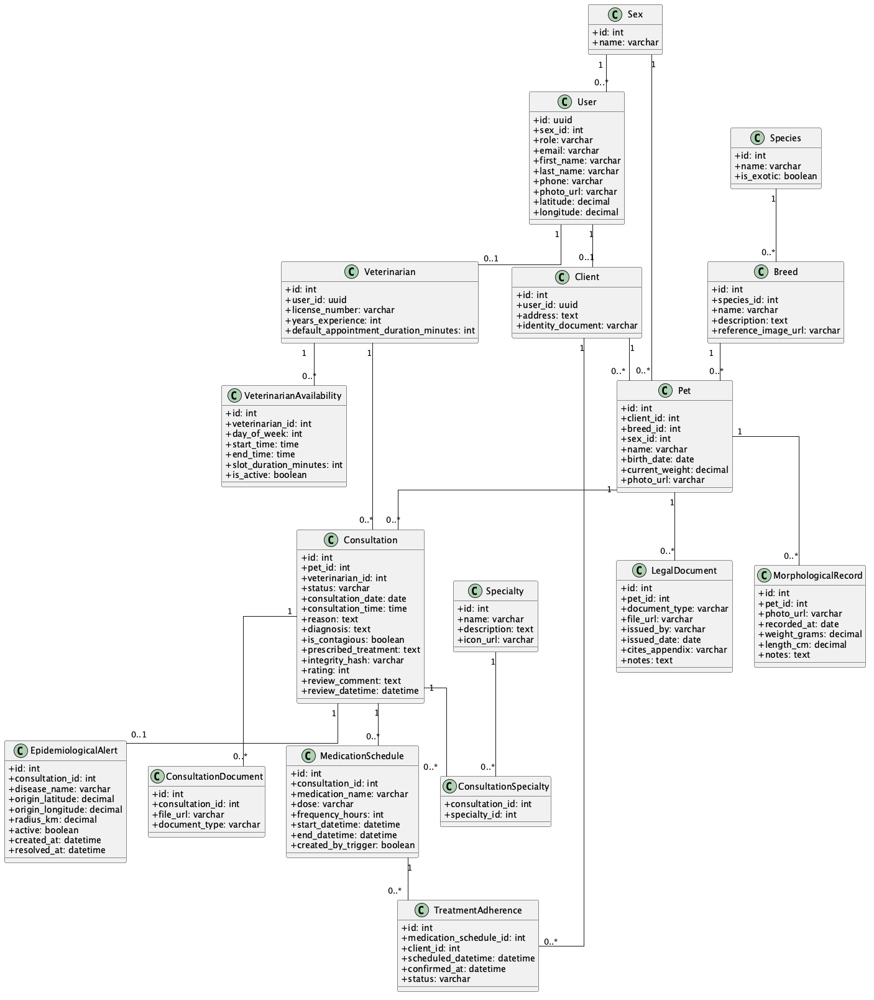

---

## Mockups (Prototipos de Interfaz)

A continuación, se detallan las interacciones principales del sistema, ordenadas por Caso de Uso. Cada sección incluye su diagrama de flujo funcional, los prototipos de interfaz (mockups) que ilustran la experiencia del usuario y los **requerimientos funcionales que satisfacen**.

#### **CU01 - Registrarse en la app**
*   **Actor principal:** Usuario no registrado
*   **Descripción:** El usuario se registra en la aplicación eligiendo un rol (Cliente o Veterinario) y proporcionando su información básica.
*   **Requisitos Satisfechos:**
    *   **RF01:** Registro de nuevos usuarios asignándoles un rol.
*   **Flujo principal:**
    1. El usuario selecciona "Regístrate" en la pantalla de inicio.
    2. El sistema muestra un selector de rol.
    3. El usuario ingresa la información requerida (nombres, teléfono, dirección, etc.).
    4. El sistema valida que el correo no exista y crea la cuenta en la base de datos.
    5. El sistema inicia la sesión automáticamente.

<p align="center">
  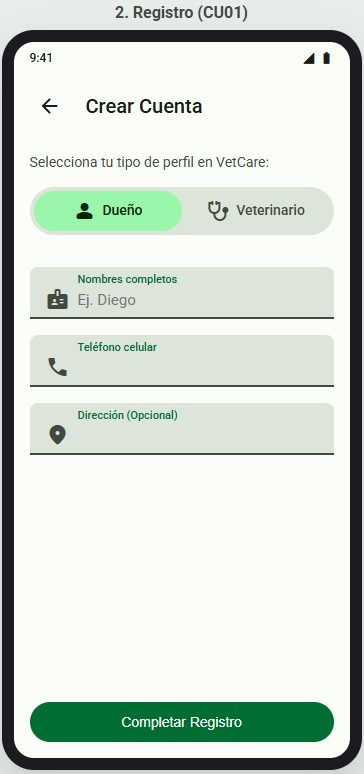
</p>

---

#### **CU02 - Iniciar Sesión**
*   **Actor principal:** Usuario (Cliente / Veterinario)
*   **Descripción:** El usuario accede a su cuenta existente en la aplicación mediante sus credenciales.
*   **Requisitos Satisfechos:**
    *   **RF02:** Inicio de sesión utilizando correo electrónico y contraseña.
    *   *RNF02:* El sistema carga el Dashboard correspondiente al rol (Autorización).
*   **Flujo principal:**
    1. El usuario abre la aplicación y visualiza la pantalla de bienvenida.
    2. Ingresa su correo electrónico y contraseña.
    3. Toca el botón "Iniciar Sesión".
    4. El sistema valida las credenciales encriptadas en la base de datos.
    5. El sistema redirige al usuario a su respectivo Dashboard.

<p align="center">
  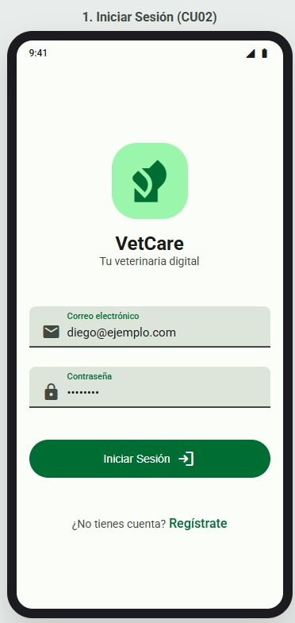
</p>

---

#### **CU03 - Editar Perfil**
*   **Actor principal:** Usuario (Cliente / Veterinario)
*   **Descripción:** El usuario administra los datos de su cuenta. Los clientes actualizan datos de contacto; los veterinarios gestionan su experiencia y especialidades.
*   **Requisitos Satisfechos:**
    *   **RF03:** Editar información del perfil según los campos permitidos para su rol.
*   **Flujo principal:**
    1. El usuario navega a la pestaña "Perfil".
    2. El sistema muestra su información personal y avatar.
    3. El usuario puede modificar sus datos editables según su rol.
    4. El sistema guarda los cambios en la base de datos.

<p align="center">
  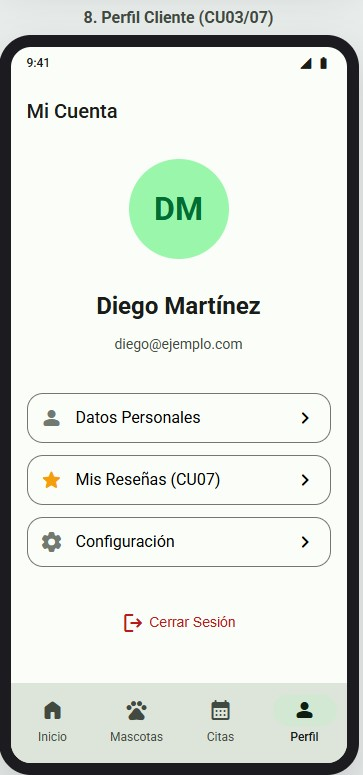
  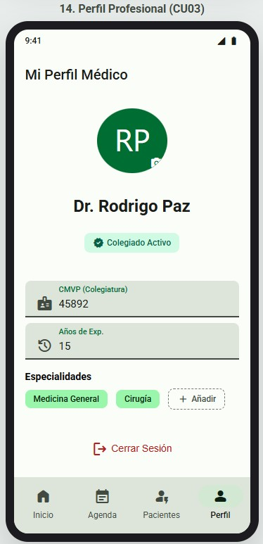
</p>

---

### Casos de Uso - Cliente

#### **CU04 - Gestionar Mascotas**
*   **Actor principal:** Cliente
*   **Descripción:** El cliente visualiza la lista de sus animales registrados, accede a sus perfiles o inscribe nuevos pacientes.
*   **Requisitos Satisfechos:**
    *   **RF04:** Registrar, editar y visualizar el perfil de mascotas.
    *   **RF05:** (Al crear mascota) Mostrar catálogo de especies y razas.
*   **Flujo principal:**
    1. El cliente selecciona la pestaña "Mascotas" en la navegación inferior.
    2. El sistema recupera de la tabla `pets` las mascotas asociadas a su ID.
    3. El usuario visualiza la lista con foto, nombre, raza, edad y sexo.
    4. El cliente puede seleccionar una mascota específica o pulsar el botón flotante (+) para registrar una nueva.

<p align="center">
  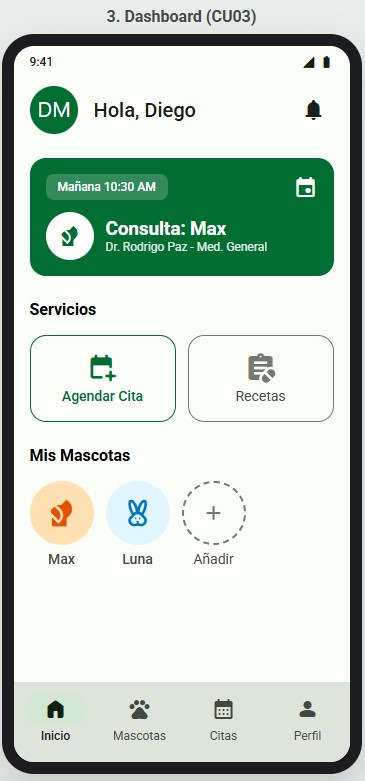
  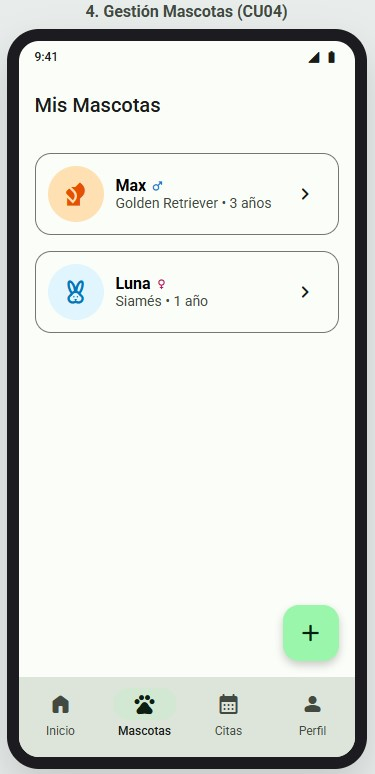
</p>

---

#### **CU05 - Agendar Consulta Médica**
*   **Actor principal:** Cliente
*   **Descripción:** El cliente reserva un turno seleccionando a la mascota paciente, el servicio, el médico y el horario.
*   **Requisitos Satisfechos:**
    *   **RF06:** Agendar consulta seleccionando mascota, veterinario, horario y motivo.
    *   **RF07:** Asignar estado "Pendiente" automáticamente a la nueva consulta.
*   **Flujo principal:**
    1. El cliente presiona el botón "Agendar Cita".
    2. El cliente escoge qué mascota necesita atención y la especialidad requerida.
    3. El sistema lista a los veterinarios disponibles filtrados por la especialidad.
    4. El cliente escoge un día y un intervalo de tiempo disponible en la agenda del doctor elegido.
    5. El cliente confirma la reservación y el sistema guarda la consulta con estado "Pendiente".

<p align="center">
  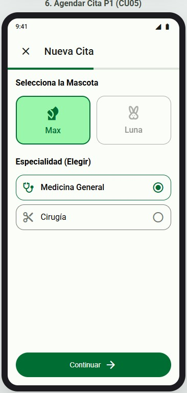
  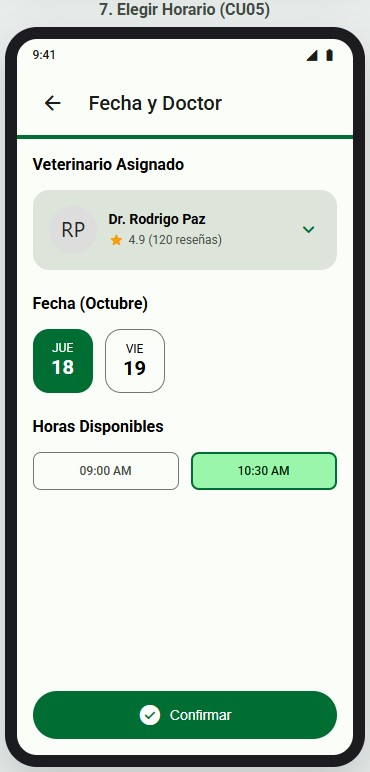
</p>

---

#### **CU06 - Visualizar Historial Clínico**
*   **Actor principal:** Cliente / Veterinario
*   **Descripción:** Permite consultar el registro médico pasado de una mascota. El cliente lo ve como historial; el veterinario lo ve como pre-consulta.
*   **Requisitos Satisfechos:**
    *   **RF12:** Visualizar el historial completo de consultas médicas de sus mascotas.
*   **Flujo principal:**
    1. El usuario selecciona una mascota desde su lista (Cliente) o agenda (Veterinario).
    2. El sistema muestra la ficha técnica estática (peso, sexo, raza).
    3. Se despliega una línea de tiempo (timeline) ordenando las consultas con estado "Completada".
    4. Se visualiza el diagnóstico de cada cita y los motivos de la misma.

<p align="center">
  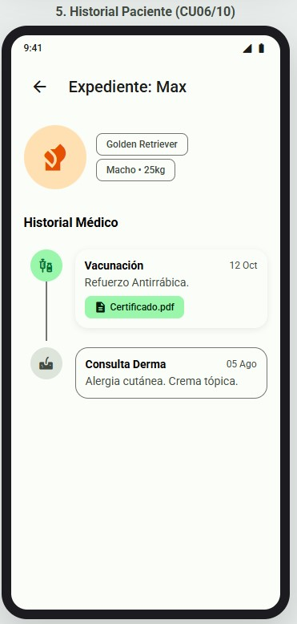
  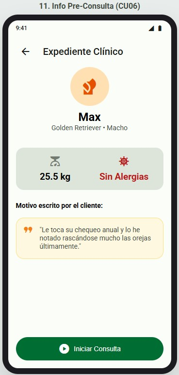
</p>

---

#### **CU07 - Evaluar Atención**
*   **Actor principal:** Cliente
*   **Descripción:** Tras finalizar una consulta (estado "Completada"), el cliente otorga estrellas (1-5) y deja un comentario sobre el servicio.
*   **Requisitos Satisfechos:**
    *   **RF13:** Otorgar calificación y reseña únicamente a consultas con estado "Completada".

<p align="center">
  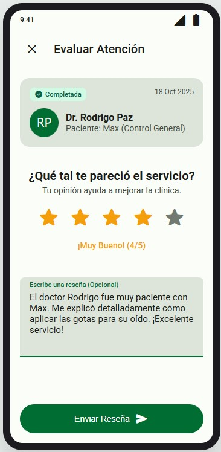
</p>

---

### Casos de Uso - Veterinario

#### **CU08 - Gestionar Agenda Médica**
*   **Actor principal:** Veterinario
*   **Descripción:** El doctor visualiza sus métricas diarias y todos sus turnos ordenados cronológicamente con sus respectivos estados.
*   **Requisitos Satisfechos:**
    *   **RF08:** Visualizar lista de consultas agendadas.
    *   **RF09:** Cambiar el estado de la consulta (ej. En curso, Completada).
*   **Flujo principal:**
    1. El veterinario ingresa a la aplicación (Dashboard) o a la pestaña "Agenda".
    2. El sistema carga las consultas asociadas a su ID desde la tabla `consultations`.
    3. El veterinario navega entre las pestañas "Hoy", "Mañana" o "Semana".
    4. Visualiza la lista de pacientes con indicadores visuales de estado (Completada, En espera, Pendiente).

<p align="center">
  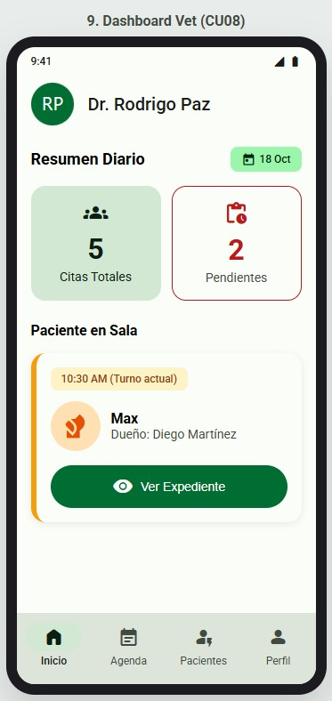
  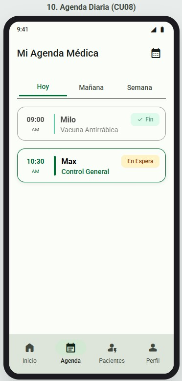
</p>

---

#### **CU09 - Registrar Datos Médicos**
*   **Actor principal:** Veterinario
*   **Descripción:** El médico documenta los hallazgos clínicos y el tratamiento a seguir durante la atención de una consulta en estado "En curso".
*   **Requisitos Satisfechos:**
    *   **RF10:** Registrar datos médicos de una consulta en curso o completada (diagnóstico, tratamiento, especialidades).
*   **Flujo principal:**
    1. El veterinario inicia la consulta médica desde la agenda.
    2. Ingresa el texto correspondiente al "Diagnóstico Clínico".
    3. Ingresa las medicinas, dosis y recomendaciones en "Tratamiento prescrito".
    4. Puede guardar un borrador o avanzar al paso de adjuntos.

<p align="center">
  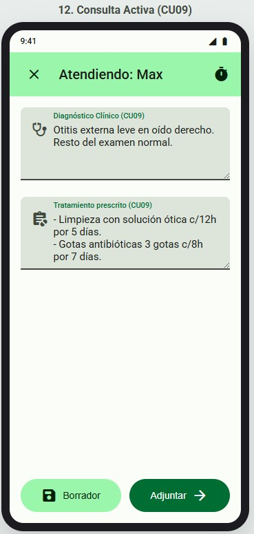
</p>

---

#### **CU10 - Adjuntar Resultados Médicos**
*   **Actor principal:** Veterinario
*   **Descripción:** El veterinario anexa documentos digitales al registro médico de la mascota y cierra el ciclo de atención.
*   **Requisitos Satisfechos:**
    *   **RF11:** Subir y visualizar documentos adjuntos vinculados a la consulta.
*   **Flujo principal:**
    1. El veterinario accede a la zona de subida (Dropzone) en la consulta activa.
    2. Selecciona archivos desde el almacenamiento del dispositivo (Recetas en PDF, radiografías, análisis de sangre).
    3. El sistema procesa, comprime y vincula los archivos a la tabla `consultation_documents`.
    4. El veterinario presiona "Guardar y Finalizar Cita", pasando la consulta al estado "Completada".

<p align="center">
  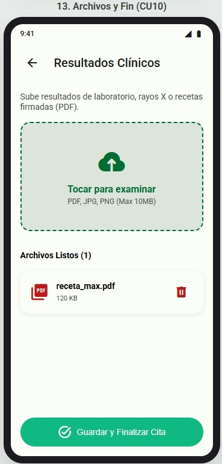
</p>
