# 📱 Programacion Movil
Proyecto del curso de Programación Móvil de la Universidad de Lima.

## Índice

Pulsa cualquiera de los subtítulos para ir directamente a la sección:

1. [Integrantes](#integrantes)
2. [Enunciado del Programa](#enunciado-del-programa-aplicación-móvil-veterinaria)
3. [Explicación del entorno de desarrollo](#explicación-del-entorno-de-desarrollo-requisitos-previos)
4. [Requerimientos](#requerimientos)
5. [Diagrama de Despliegue](#diagrama-de-despliegue)
6. [Casos de Uso](#casos-de-uso)
7. [Descripción de Casos de Uso](#descripción-de-casos-de-uso)
8. [Diagrama de Base de Datos](#diagrama-de-base-de-datos-schema)
9. [Diagrama de Clases](#diagrama-de-clases)
10. [Mockups](#mockups-prototipos-de-interfaz)

## 👥 Integrantes
- Juan Zavalaga
- Franco Melchor  
- Matias  Alarcon
- Nicolas Champa  

## 📝 Enunciado del Programa (Aplicación Móvil Veterinaria)

Una clínica veterinaria requiere el desarrollo de una aplicación móvil para la gestión de sus servicios de salud animal y el historial médico de sus pacientes. El sistema debe centralizar la información de todos sus usuarios (clientes -dueño de la mascota- y veterinarios), quienes deben registrar sus nombres, apellidos, correo electrónico, contraseña, teléfono de contacto, una foto de perfil y su sexo.

Existen dos tipos de perfiles de usuario:
- Clientes: Son los dueños de las mascotas, de quienes se debe registrar además su dirección y documento de identidad.
- Veterinarios: Profesionales de la clínica de los cuales se requiere el número de colegiatura y sus años de experiencia.

Para facilitar el seguimiento de sus animales, los clientes pueden registrar múltiples mascotas, identificando para cada una su nombre, fecha de nacimiento, sexo, peso actual y una fotografía. Cada mascota pertenece a una raza específica, la cual está asociada a una especie (como canino, felino o exótico). El registro de la raza incluye su nombre, una descripción y una imagen referencial.

A través de la app, los clientes pueden agendar consultas médicas para sus mascotas seleccionando a un veterinario. Al agendar, el cliente elige uno de los horarios disponibles definidos por intervalos en la agenda del veterinario, junto con el motivo de la visita, creando la consulta con un estado inicial (por ejemplo: pendiente). Durante la atención, el veterinario actualiza el estado y registra el diagnóstico, tratamiento recetado y documentos adjuntos.

Además, las atenciones pueden clasificarse en múltiples especialidades o servicios (como medicina general, dermatología, traumatología o peluquería), de las cuales se registra su nombre, descripción y un ícono representativo. Finalmente, para medir la calidad del servicio, los clientes pueden calificar (1, 2, 3, 4 o 5) y dejar reseñas sobre las consultas que han finalizado (completadas), indicando su opinión detallada y la fecha y hora en que publicaron su comentario.

## Explicación del entorno de desarrollo (Requisitos Previos)

Para la construcción de este proyecto, se ha seleccionado un stack tecnológico orientada a una arquitectura cliente-servidor. A continuación, se detallan las herramientas utilizadas, su propósito y el proceso de configuración necesario.

### 1. Flutter y Dart (Front-end)
* **Descripción:** Flutter es el SDK de Google para crear aplicaciones compiladas nativamente para móvil desde una única base de código. Utiliza **Dart**, un lenguaje optimizado para interfaces de usuario rápidas y reactivas.
* **Instalación:**
    1.  Descarga el SDK de Flutter desde [flutter.dev](https://docs.flutter.dev/get-started/install) según tu sistema operativo.
    2.  Extrae el archivo en una ruta sin espacios (ej: `C:\src\flutter`).
    3.  Agrega la carpeta `bin` de Flutter a las variables de entorno de tu sistema (**PATH**).
    4.  Ejecuta `flutter doctor` en la terminal para verificar dependencias de Android/iOS pendientes.

### 2. Ruby (Backend / API)
* **Descripción:** Ruby es un lenguaje dinámico y orientado a objetos, elegido por su agilidad en el desarrollo de la lógica de negocio y la gestión de servicios RESTful que consumirá la app móvil.
* **Instalación:**
    * **Windows:** Usa [RubyInstaller](https://rubyinstaller.org/) (versión con Devkit). Al instalar, marca la opción "Add Ruby executables to your PATH".
    * **macOS/Linux:** Se recomienda usar un gestor como `rbenv` o `rvm`. Ejemplo: `brew install rbenv` seguido de `rbenv install 3.x.x`.
    * Verifica con el comando: `ruby -v`.

### 3. SQLite (Base de Datos)
* **Descripción:** Un motor de base de datos relacional ligero y embebido en el servidor backend. No requiere un proceso de servidor separado, facilitando la portabilidad y el desarrollo rápido.
* **Instalación:**
    * **Sistemas Unix (Mac/Linux):** Generalmente ya está preinstalado.
    * **Windows:** Descarga los "Precompiled Binaries for Windows" de [sqlite.org](https://www.sqlite.org/download.html), extrae el archivo `sqlite3.exe` y colócalo en una carpeta incluida en tu **PATH**.
    * **Gem de Ruby:** Instala el adaptador ejecutando `gem install sqlite3` en tu terminal.

### 4. Visual Studio Code (IDE)
* **Descripción:** Editor de código fuente versátil que sirve como estación de trabajo principal para el desarrollo de todas las capas de la aplicación.
* **Configuración:**
    1.  Descarga e instala [VS Code](https://code.visualstudio.com/).
    2.  Instala la extensión oficial de **Flutter** (esto instalará automáticamente Dart).
    3.  Instala la extensión **Ruby LSP** para obtener soporte de sintaxis y depuración en el backend.

### 5. Android Studio
* Para mayor comidad para el entorno de desarrollo móvil (Front-end) y no depender de extensiones en VS Code, instalar Android Studio es la mejor opción (incluyendo SDKs de Android).

## Requerimientos

### 1. Requerimientos Funcionales:
Lo que el sistema debe hacer (acciones y funcionalidades específicas)

* Gestión de Usuarios y Autenticación:
    * **RF01:** El sistema debe permitir el registro de nuevos usuarios asignándoles un rol específico (Cliente o Veterinario).
    * **RF02:** El sistema debe permitir a los usuarios iniciar sesión utilizando su correo electrónico y contraseña.
    * **RF03:** El sistema debe permitir a los usuarios (clientes y veterinarios) editar la información de su perfil (teléfono, foto de perfil, et*) según los campos permitidos para su ro*

* Gestión de Mascotas y Catálogo:
    * **RF04:** El sistema debe permitir a los clientes registrar, editar y visualizar el perfil de sus mascotas (nombre, fecha de nacimiento*sexo, peso actual y foto).
    * **RF05:** El sistema debe mostrar un catálogo predefinido de especies y razas al momento de registrar una mascota, mostrando la descripció*y foto referencial de la raza.

* Gestión de Consultas (Agendamiento y Atención):
    * **RF06:** El sistema debe permitir al cliente agendar una consulta médica, seleccionando a la mascota, el veterinario, uno de los horarios disponibles y redactando el motivo de la visita.
    * **RF07:** El sistema debe asignar automáticamente el estado "Pendiente" a toda nueva consulta generada por un cliente.
    * **RF08:** El sistema debe permitir al veterinario visualizar una lista de las consultas que tiene agendadas.
    * **RF09:** El sistema debe permitir al veterinario cambiar el estado de la consulta (ej. Confirmada, En curso, Completada, Cancelada).
    * **RF10:** El sistema debe permitir al veterinario registrar los datos médicos de una consulta en curso o completada, incluyendo diagnóstico, tratamiento recetado y las especialidades aplicadas.
    * **RF11:** El sistema debe permitir al veterinario subir y visualizar documentos adjuntos (archivos o imágenes como radiografías) vinculados a la consulta.
    * **RF12:** El sistema debe permitir al cliente visualizar el historial completo de consultas médicas de sus mascotas, incluyendo el detalle de diagnósticos, tratamientos recetados y documentos adjuntos (archivos o imágenes) proporcionados por el veterinario, una vez que la consulta tenga el estado "Completada".

* Sistema de Evaluación:
    * **RF13:** El sistema debe permitir al cliente otorgar una calificación (del 1 al 5) y escribir una reseña únicamente a las consultas que tengan el estado "Completada".

### 2. Requerimientos No Funcionales:
* Cómo debe comportarse el sistema (atributos de calidad, restricciones y rendimiento).
    1. **RNF01 (Seguridad):** Las contraseñas de los usuarios deben estar encriptadas en la base de datos (por ejemplo, mediante algoritmos como bcrypt).
    2. **RNF02 (Seguridad/Autorización):** El sistema debe restringir las vistas y acciones según el rol del usuario (ej. un cliente no puede modificar un diagnóstico ni cambiar el estado de la consulta).
    3. **RNF03 (Autenticación):** El sistema debe usar JWT para la autenticación del usuario antes de ejecutar servicios, este token debe ser guardado en "Keychain/Keystore" del móvil y ser enviado en la cabecera (Authorization) en cada petición.
    4. **RNF04 (Rendimiento):** La aplicación móvil debe cargar las vistas principales en menos de 3 segundos bajo una conexión de red estándar (4G/WIFI).
    5. **RNF05 (Almacenamiento):** Las imágenes (fotos de perfil, mascotas, documentos médicos) deben ser comprimidas antes de subirse al servidor para optimizar el espacio y los tiempos de carga.
    6. **RNF06 (Disponibilidad):** La API y la base de datos deben estar alojadas en la nube, garantizando una alta disponibilidad (uptime del 99.9%).
    7. **RNF07 (Usabilidad):** La interfaz debe ser intuitiva y adaptable (Responsive) a diferentes tamaños de pantalla en dispositivos móviles (smartphones y tablets).

## Diagrama de Despliegue
Puedes encontrar el diagrama de despliegue en el archivo:
- `deployment_diagram.puml` (ubicado en la raíz del repositorio)

## Casos de Uso
Los casos de uso representan las interacciones principales de los actores (Cliente y Veterinario) con el sistema.
* Actor Común: Cliente y Veterinario
    * **CU01 - Registrarse en la app:** El actor completa el formulario para crear su cuenta de usuario con su rol respectivo.
    * **CU02 - Iniciar Sesión:** El actor ingresa sus credenciales para acceder a sus funciones habilitadas.
    * **CU03 - Editar Perfil:** El actor modifica sus datos personales de contacto o actualiza su foto de perfil.
* Actor: Cliente
    * **CU04 - Gestionar Mascotas:** El cliente crea, actualiza o visualiza el historial básico de sus mascotas.
    * **CU05 - Agendar Consulta Médica:** El cliente elige a su mascota, selecciona a un médico de la clínica, escoge uno de los horarios disponibles y envía la solicitud.
    * **CU06 - Visualizar Historial Clínico:** El cliente ingresa al perfil de su mascota y consulta los registros médicos pasados, pudiendo leer las recetas y descargar las radiografías o análisis adjuntos.
    * **CU07 - Evaluar Atención:** Tras finalizar una consulta, el cliente selecciona las estrellas (1-5) y deja un comentario sobre el servicio recibido.
* Actor: Veterinario
    * **CU08 - Gestionar Agenda Médica:** El veterinario visualiza su calendario de citas y actualiza el estado de las consultas solicitadas.
    * **CU09 - Registrar Datos Médicos:** El veterinario ingresa el diagnóstico y el tratamiento de una mascota durante o después de su cita.
    * **CU10 - Adjuntar Resultados Médicos:** El veterinario sube archivos PDF o imágenes (como análisis de sangre o radiografías) a la consulta específica.

Puedes encontrar el diagrama de casos de uso en el archivo:
- `use_cases_schema.puml` (ubicado en la raíz del repositorio)

### Diagramas Completos de Casos de Uso

Las siguientes imágenes contienen los diagramas completos de los casos de uso (cada imagen representa la mitad del diagrama completo). Se muestran apiladas una debajo de la otra para facilitar su lectura e impresión.

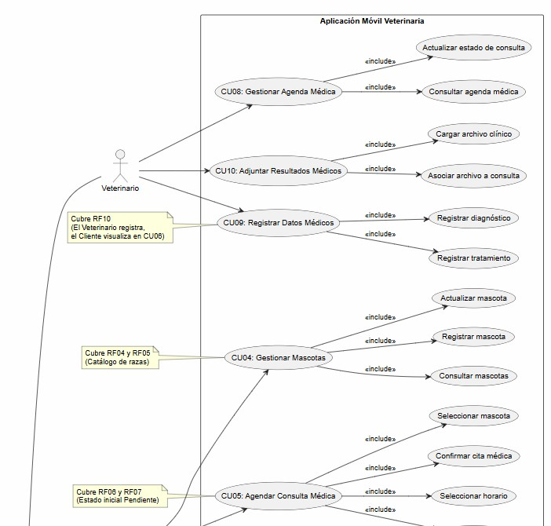

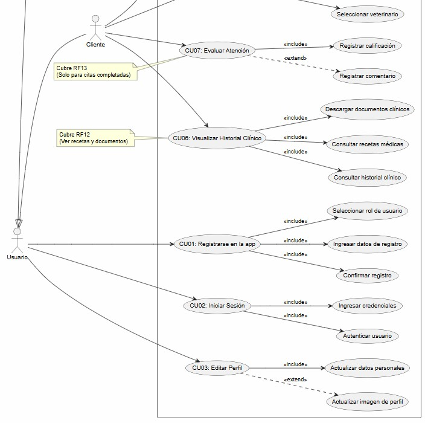

## Descripción de Casos de Uso

Los casos de uso documentados a continuación corresponden a los requisitos funcionales (RF01-RF13) y están relacionados directamente con el diagrama de base de datos y los mockups de interfaz.

### Diagramas Detallados de Casos de Uso

#### Casos de Uso Comunes (Cliente y Veterinario)

**CU01 - Registrarse en la app**
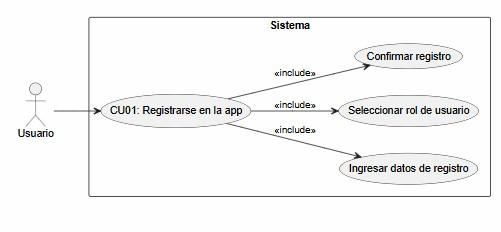

**CU02 - Iniciar Sesión**
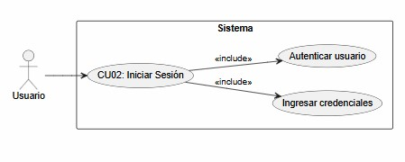

**CU03 - Editar Perfil**
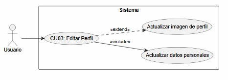

---

#### Casos de Uso - Cliente

**CU04 - Gestionar Mascotas**
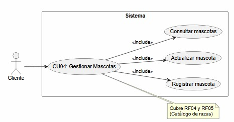

**CU05 - Agendar Consulta Médica**
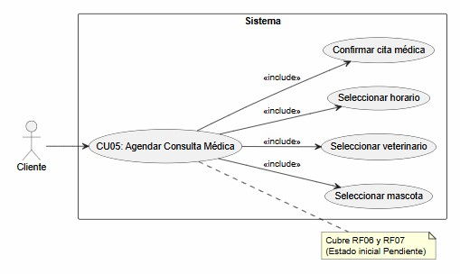

**CU06 - Visualizar Historial Clínico**
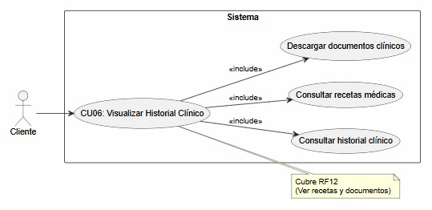

**CU07 - Evaluar Atención**
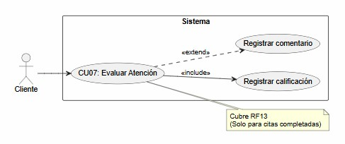

---

#### Casos de Uso - Veterinario

**CU08 - Gestionar Agenda Médica**
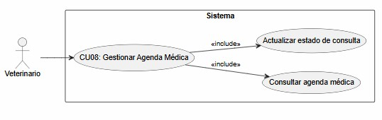

**CU09 - Registrar Datos Médicos**
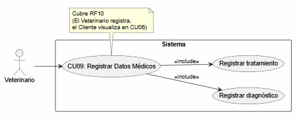

**CU10 - Adjuntar Resultados Médicos**
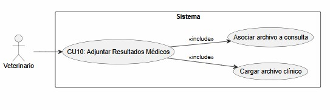

## Diagrama de Base de Datos (Schema)

Para soportar todos los requisitos funcionales, se diseñó un modelo de entidades relacional que incluye:

- **users y roles**: Gestión de usuarios con autenticación (clientes y veterinarios)
- **clients y veterinarians**: Datos específicos por tipo de usuario
- **species y breeds**: Catálogo predefinido de especies y razas
- **pets**: Registro de mascotas con sus atributos (nombre, fecha de nacimiento, sexo, peso, foto)
- **veterinarian_availability**: Disponibilidad semanal de veterinarios con intervalos de tiempo
- **consultations**: Registro de consultas médicas con estado, diagnóstico, tratamiento
- **consultation_documents**: Adjuntos de radiografías y análisis
- **consultation_specialties**: Clasificación de especialidades por consulta

El diagrama completo se encuentra en: `schema.puml` (ubicado en la raíz del repositorio)

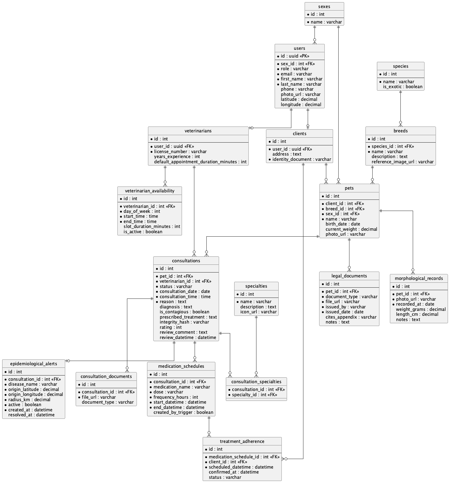

---

## Diagrama de Clases

El siguiente diagrama de clases muestra los modelos de dominio propuestos derivados del esquema de base de datos. Está pensado para orientar la implementación de los `models` en el backend y su mapeo a tablas mediante un ORM (por ejemplo ActiveRecord en Ruby).

- Propósito: documentar las entidades del dominio, sus atributos principales y las relaciones entre ellas.
- Uso recomendado: servir como guía para crear clases de dominio y migraciones; los métodos y la lógica de negocio deben añadirse en el código fuente, no en este diagrama.
- Notas de mapeo: cada clase corresponde a una tabla del esquema; los atributos primarios son los campos persistidos; las asociaciones 1..* y 0..* indican claves foráneas y colecciones.
- Limitaciones: el diagrama no incluye operaciones (métodos) ni visibilidad; tampoco modela validaciones ni reglas de negocio.

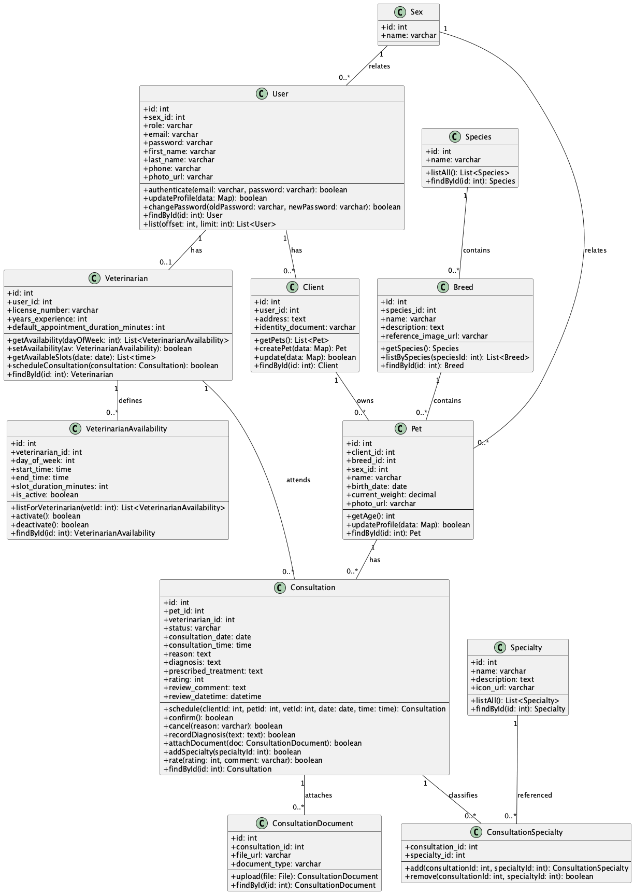

---

## Diagrama de Despliegue

La arquitectura del sistema está compuesta por:

1. **Dispositivo Móvil**: Aplicación Flutter con módulo de compresión de imágenes y almacenamiento seguro de JWT
2. **Servidor Backend**: API REST en Ruby con módulo de seguridad (Bcrypt + JWT)
3. **Base de Datos**: SQLite embebida en el servidor
4. **Infraestructura Cloud**: Alojamiento con alta disponibilidad (99.9%)

El diagrama de despliegue con mapeo de requisitos no funcionales se encuentra en: `deployment_diagram.puml` (ubicado en la raíz del repositorio)

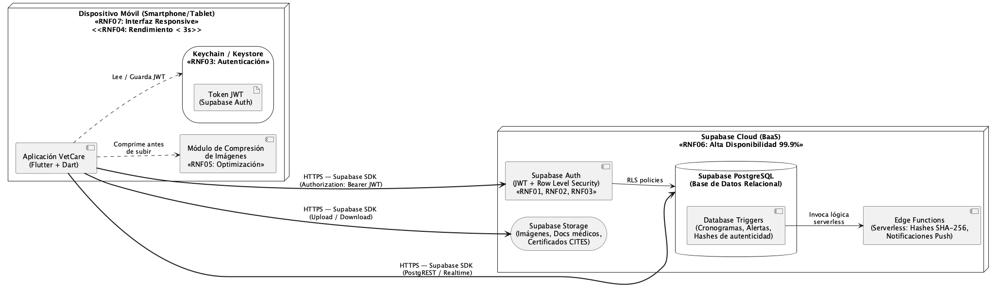

---

## Mockups (Prototipos de Interfaz)

Los mockups representan las pantallas principales de la aplicación, diseñadas de acuerdo a los requisitos funcionales y casos de uso documentados:

- **VISTA 7 - Agendar Cita P2**: Selección de fecha y hora disponibles (CU05 - RF06, RF07)
- **VISTA 8 - Home Veterinario (CU08)**: Visualización de agenda médica del veterinario
- **VISTA 9 - Consulta en Curso (CU09)**: Registro de diagnóstico y tratamiento durante la consulta
- **VISTA 10 - Perfil Usuario (CU03)**: Edición de datos personales del usuario

### Mockups Funcionales de Casos de Uso Cliente

**Selección de Horarios y Agendamiento (CU05)**
- Interfaz: Calendario con intervalos de tiempo disponibles
- Componentes: Selector de mascota, veterinario, horario, motivo
- Requisitos cubiertos: RF06, RF07

**Historial Clínico de la Mascota (CU06)**
- Interfaz: Listado de consultas completadas con diagnóstico y tratamiento
- Componentes: Datos de mascota, historial de consultas, recetas, documentos adjuntos
- Requisitos cubiertos: RF12
